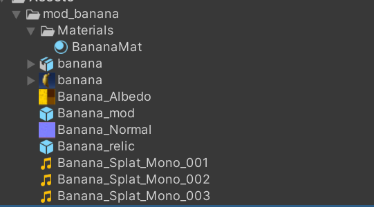

Common library to be used by modding tools and main Void Crew project

## Requirements

* Unity Editor 2022.3.62f2

## Installation

* Create a new HDRP project in Unity
* Import package XXX via UPM (wip)

## Samples

The following repository contains a sample project with a couple of carryables that can be exported and used as Mod assets for Void Crew

https://github.com/HutlihutGames/void_crew_mod_asset_generation

## Creating assets

All assets that are to be exported (prefabs/scriptable objects) should be placed in a folder that contains all the asset dependencies:

### Prefabs 

Prefabs that are to be exported should include component of `VoidCrewAsset`

### Drop tables

To have the created asset go in to loot tables, attach the `LootTableItem` component

Within the component, you can configure:
* Sector completion reward: the item gets added to the sector objective reward pool
  * Weight: Chance of the item being dropped, 1 being the default for all existing items (so value of 2 will make the appear twice as often)
  * Amount: How many of the item will be dropped
  * Chapters: What parts of the run should the drop be available in. Currently the game only uses chapters 0 and 1, 0 representing the first solar system of the run, 1 being used by the rest)
  * Encounter difficulty: What difficulty will the drops appear in
* Drop table entries, controls misc tables for drops used by various systems: 
  * Weight: Chance of the item being dropped, 1 being the default for all existing items (so value of 2 will make the appear twice as often)
  * Amount: How many of the item will be dropped
  * Rarity: TBD
  * Location type: Where the drop can appear
  * Drop category: What table to add the item to

#### Carryables

For creating carryables, attach the `CarryableBaseAsset` or one of its extensions (`CarryableStatModAsset`, ...)
